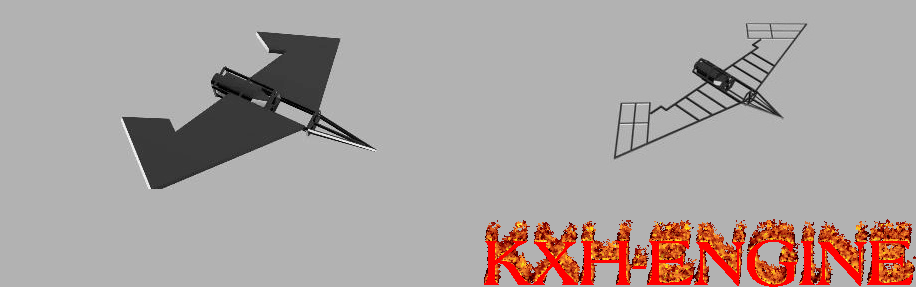

# KXH-ENGINE

KXH-ENGINE is experimental, Python writed, shell that provide user to analyse 3D/2D data form real UAV or make a complex simulations.
  
The engine is to enable not only the analysis of recorded data, but also downloading them directly from the unit in motion and processing them in real time. The current priority is to create an environment capable of controlling the drone itself and the early versions of the computing engine and adapting it to simple physical tasks.
 
The advantage of the engine is that it can be used on any platform. This means that it can be used equally on Windows, MacOS and Linux
  
This engine is a form of a school-research project on the use of air engineering techniques with ICT knowledge and acquired in the field of programmer during the education process.

 

All cooperation should be sent by e-mail to the following address: dilerdanych@gmail.com
Any financial donation to support the project is not yet possible, but if necessary, it will be made available

  

### Functions

 - Working event handling and a 3D engine based on a mathematical algorithm (working)
 - Working event handling and a 2D engine based on a mathematical algorithm (in development)
 - Acceleration of 3D and 2D graphics using the OpenGL algorithm (in development)
 - Basic mechanics of physical events
 - Network engine to connect to a real device
 - Remote control of events of a real device
 - Control, analysis and simulation of engine statistics
 - Immediate analysis of data collected from the flying object
 - more soon

  
### WARNING!!
The engine is currently in the alpha phase. This means that stable use of its functions is impossible. It is recommended to wait until the next first official alpha / beta 0.1v release to use. Right now, however, you can download and compile the code at your own risk.

